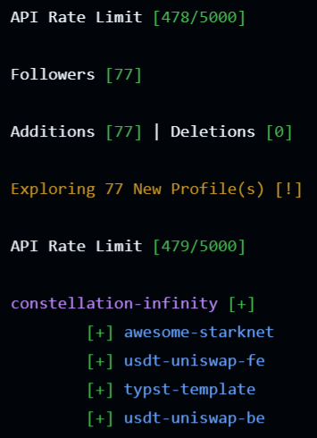

<div align="center">
  <h1>Github-Follow-N-Star-Action ⭐</h1>
  
  A daily `Github Actions` program that helps users follow back their Github followers & star their top-4 repositories. This repository uses `Github Actions` to automate this process and `Vercel` to simplify cloning this repository for users to their Github account.

  </img>
</div>


<br/>
<details>
  <summary><strong>Table of Contents</strong></summary>
  
  - [Initial Setup](#initial-setup)
  - [Running Actions Workflow](#running-actions-workflow)
  - [Actions Workflow Timing](#actions-workflow-timing)
  - [Github API Rate Limit & Actions Allowance](#github-api-rate-limit--actions-allowance)
  - [Running Project Locally](#running-project-locally)
  - [Output Example](#output-example)
  - [References](#references)
  - [Inspiration](#inspiration)
  
</details>
<br/>


## Initial Setup
1. **Clone The Repository** 👨‍🔬
    - [](https://vercel.com/new/clone?repository-url=https%3A%2F%2Fgithub.com%2FSVENTRIPIKAL%2FGithub-Follow-N-Star-Action)

1. **Delete Data in your <a href="./EXPLORED_LOGINS" target="_blank" rel="noopener noreferrer">EXPLORED_LOGINS</a> File** 📄

1. **Create Github Actions Workflow** 👨‍💻
    - Click *`Add File > Create New File`* in your Project Directory
    - Copy and Paste: 
        - *`.github/workflows/actions.yml`* as the Name of your File
        - The Contents from *<a href="https://github.com/SVENTRIPIKAL/Github-Follow-N-Star-Action/blob/main/.github/workflows/actions.yml" target="_blank" rel="noopener noreferrer">actions.yml</a>* into your File
    - Click *`Commit Changes`*

1. **Grant Workflow Read/Write Permission** ✍️
    - *`{Cloned_Repo_Name} > Settings > Actions > General`*
    - Scroll Down to *`Workflow Permissions`*
    - Click *`Read and Write Permissions`*
    - Click *`Save`*

1. **Create Personal Access Token** 🥇
    - *[Account > Settings > Developer Settings > Personal Access Tokens > Tokens (Classic)](https://github.com/settings/tokens)*
    - Click *`Generate New Token > Generate New Token (Classic)`*
    - Name Your Token (example: *`GITHUB_API_FOLLOW_N_STAR`*)
    - Choose an Expiration Date
    - Select Scopes:
        - *`public_repo`*
        - *`read:user`*
        - *`user:follow`*
    - Click *`Generate Token`*
  > [!WARNING]
  > `Copy` your `Personal Access Token value` now. You won’t be able to see it again!

6. **Create Repository Secrets** 🤐
    - *`{Cloned_Repo_Name} > Settings > Secrets and Variables > Actions`*
    
    - Create 2 Repository Secrets:
        1. ***PERSONAL_ACCESS_TOKEN***
            - *`Bearer {Personal_Access_Token_Value}`*
            
        2. ***PERSONAL_USERNAME***
            - *`{Your_Github_Username}`*

7. **Profit** 💸

---

## Running Actions Workflow
- **Manual:**
    - *Manual executions can be achieved by visiting the repository's `Actions` section, selecting the `Follow-N-Star-Action` workflow, and clicking `Run Workflow`*

- **Scheduled:**
    - *The program is scheduled to execute `@12pm every day`. This can be changed in the `.github/workflows/actions.yml` file by adjusting the `Cron Expression` to fit your needs*

```yaml
on:
  schedule:
    - cron: '0 12 * * *'  # run @12pm every day
```

---

## Actions Workflow Timing
- **Environment Setup:**
    - *~8 seconds*
      
- **Cost Per Follower:**
    - *~7.28 seconds*

---

## Github API Rate Limit & Actions Allowance
> [!IMPORTANT]
> API Limit: 5,000 requests per/Hour | Actions Allowance: 2,000 minutes (500MB) per/Month.

Using the new `Personal Access Token` created earlier for this repository, API rates will be limited to `5,000 requests per hour`, as well as a `2,000 minute (500MB) free monthly Actions` allowance. Currently, the program only has a protection in place to prevent exceeding the user API limit rate:
```python
def check_user_api_info(self, threshold=4000):
``` 
(`line-97` in the `model/github_api_client.py` file, which can be increased), so it's advised that users keep track of their `Actions` usage. Adjusting the `Cron Expression` to execute the program less times a month can also help with this as well.

> [!TIP]
> If the program stops early due to exceeding the `API threshold`, the workflow can be ran again after `1-hour` once the user's API rate limit has refreshed, since the program saves explored profiles to file and continues with those not saved to file (as long as `Actions` minutes remain).

---

## Running Project Locally
Cloning the project to your local machine will leave you with import errors & an inability for the program to access your `github secrets`. To remedy this, you need to create a quick `virtual environment` to install the project requirements, as well as a `.env` file containing your github secrets that can be accessed locally by the program as environment variables. Both will be located in your project directory.

> [!WARNING]
> Ensure the `venv` directory & `.env` file are being ignored by `git` if you plan to push changes to your repository!

1. Create Environment:
    ```linux
    python -m venv venv
    ```
2. Activate Environment:
    ```linux
    source ./venv/Script/activate
    ```
3. Verify Python & Pip Executables:
    ```linux
    (venv)
    which python pip
    
    > .../venv/Scripts/python
    > .../venv/Scripts/pip
    ```
4. Install Project Requirements:
    ```linux
    (venv)
    pip install -r ./requirements.txt
    ```

> [!NOTE]
> To consolidate project requirements, set your IDE's `default interpreter` to the environment's `python.exe`.

5. Create a .env File with your Repository Secrets:
    ```
    PERSONAL_USERNAME = "{Your_Github_Username}"
    PERSONAL_ACCESS_TOKEN = "Bearer {Personal_Access_Token_Value}"
    ```

    Once complete, import errors will be gone & the program should run with successful Github API authentication. All `project requirements` can then be found in `./venv/Lib/site-packages`.

---

## Output Example


---

## References

For more information explaining previous topics and all documentation used for creating this project, the following links have been curated:

##### Vercel

* [Working with the Deploy Button](https://vercel.com/docs/deploy-button)

* [Configuring Projects with Vercel.json](https://vercel.com/docs/project-configuration)

##### Personal Access Tokens

* [Creating a Personal Access Token (Classic)](https://docs.github.com/en/authentication/keeping-your-account-and-data-secure/managing-your-personal-access-tokens#creating-a-personal-access-token-classic)

* [Personal Access Token Scopes](https://docs.github.com/en/apps/oauth-apps/building-oauth-apps/scopes-for-oauth-apps#available-scopes)

##### API Rates & Actions Allowances

* [Rate Limits for the REST API](https://docs.github.com/en/rest/using-the-rest-api/rate-limits-for-the-rest-api?apiVersion=2022-11-28#primary-rate-limit-for-authenticated-users)

* [GitHub Actions Allowance](https://docs.github.com/en/billing/concepts/product-billing/github-actions)

##### REST API Endpoints & Practices

* [Authenticating to the REST API](https://docs.github.com/en/rest/authentication/authenticating-to-the-rest-api?apiVersion=2022-11-28)

* [Using Pagination in the REST API](https://docs.github.com/en/rest/using-the-rest-api/using-pagination-in-the-rest-api?apiVersion=2022-11-28)

* [REST API endpoints for Followers](https://docs.github.com/en/rest/users/followers?apiVersion=2022-11-28&versionId=free-pro-team%40latest&restPage=using-pagination-in-the-rest-api#list-followers-of-the-authenticated-user)

* [REST API endpoints for Starring](https://docs.github.com/en/rest/activity/starring?apiVersion=2022-11-28#star-a-repository-for-the-authenticated-user)

* [REST API endpoints for Repositories](https://docs.github.com/en/rest/repos/repos?apiVersion=2022-11-28#list-repositories-for-a-user)

##### Github Actions

* [Adding a Workflow Status Badge](https://docs.github.com/en/actions/how-tos/monitor-workflows/add-a-status-badge)

* [Workflow Syntax for GitHub Actions](https://docs.github.com/en/actions/reference/workflows-and-actions/workflow-syntax)

* [Github Actions Events: Schedule](https://docs.github.com/en/actions/reference/workflows-and-actions/events-that-trigger-workflows#schedule)

* [Using Secrets in GitHub Actions](https://docs.github.com/en/actions/how-tos/write-workflows/choose-what-workflows-do/use-secrets)

* [Github Actions Extensions](https://github.com/marketplace?verification=verified_creator&type=actions)

##### Python Virtual Environments

* [Creating Virtual Environments: venv](https://docs.python.org/3/library/venv.html)

##### Locally Managing Environment Secrets

* [Using a .env File with Github Actions](https://stackoverflow.com/questions/60176044/how-do-i-use-an-env-file-with-github-actions)

* [Using Python-Dotenv to Load Environment Variables from .env](https://www.getorchestra.io/guides/using-os-environ-with-local-settings-in-vs-code-settings-json)

---

## Inspiration
Grew tired of manually following users & starring more than 1 of their repos 😅
